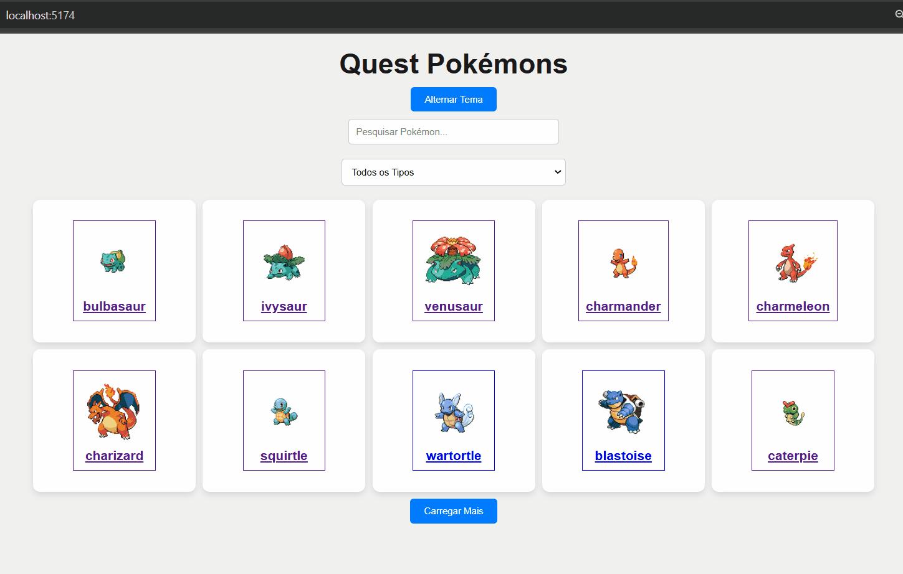
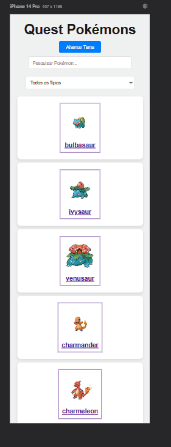

<h1 align="center">Quest Pokémons</h1>

Tabela de conteúdos
=================

   * Sobre o projeto
   * Tecnologias
   * Layout
## Sobre o Projeto

Bem seguindo os módulos do curso DevQuest Full-Stack, agora no módulo React Avançado, sendo como um Teste Técnico, o projeto foi desenvolvido com React, possui alternância entre tema claro e escuro, pesquisa por nome e tipo, além de exibir detalhes de cada Pokémon em um layout responsivo, para se adaptar a diferentes tamanhos de tela, para uma melhor experiência do usuário, não posso também de comentar que foi Implementado testes utilizando jest. Sem dúvida o desafio mais dificil que eu enfrentei até o momento, por toda tecnologia utilizada, tentar expor praticamente tudo o que foi absorvido no curso até o momento, por tudo que foi pedido para ser executado, por mais simples que pareça, saindo do zero e entregar essa QUEST é algo diferenciado.

## 🛠 Funcionalidades:

📜 Listagem de Pokémons: Exibe 10 Pokémons por vez com a opção de carregar mais.

🔍 Pesquisa por Nome e Tipo: Pesquise Pokémons de forma rápida e eficiente.

🌗 Alternância de Tema (Claro/Escuro): Interface adaptável ao gosto do usuário.

📄 Detalhes do Pokémon: Visualize informações detalhadas como habilidades, movimentos e tipos.

📱 Responsividade: Compatível com notebooks, tablets e dispositivos móveis.

✅ Testes Unitários: Cobertura de testes utilizando Jest e React Testing Library.

## 🛠 Tecnologias utilizadas

React (SPA)

React Router DOM para navegação entre páginas

Context API para gerenciamento do tema

Styled-Components para estilização

Jest e React Testing Library para testes unitários

<a  href=https://pokeapi.co/ target="_blank">PokéAPI</a> para consumo de dados dos Pokémons

## 🎨 Layout

Quest Pokémons:

### Mobile 📱:

Para uma melhor experiência acessem:
      <a  href=https://carvalhorp2022.github.io/form-with-validation/ target="_blank">Formulário</a>

